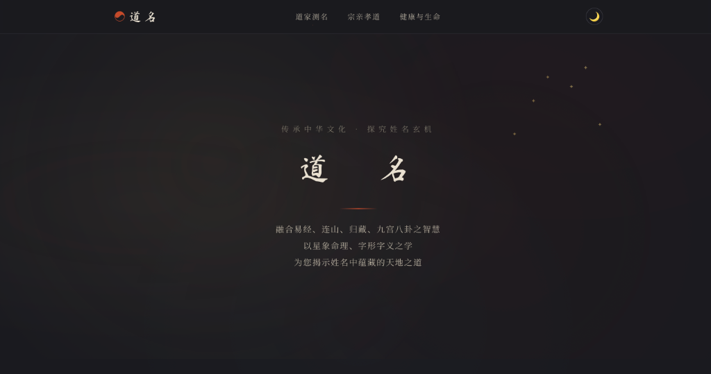

<p align="center">
  
</p>

<h1 align="center">☯ 道名</h1>

<p align="center">
  <strong>中国传统孝道祭祀文化</strong><br>
  融合易经 · 连山 · 归藏 · 九宫八卦 · 字形字义
</p>

<p align="center">
  <a href="#道家测名">道家测名</a> ·
  <a href="#宗亲孝道">宗亲孝道</a> ·
  <a href="#健康与生命">健康与生命</a>
</p>

---

## ✨ 特色

- 🎨 **中国古典审美** — 以传统水墨宣纸色调为基础，书法字体，简洁禅意
- 🌓 **日夜自动切换** — 根据时间自动切换日间/夜间模式，也可手动切换
- 🤖 **AI 命理分析** — 集成 DeepSeek API，从六大维度深度解析姓名
- 💰 **付费增值逻辑** — 免费用户可见部分分析，付费解锁完整报告与改名建议

---

## 📜 三大板块

### 道家测名

依据星象、易经、连山、归藏、九宫八卦，结合字形字义，从以下六个维度分析姓名：

| 维度        | 说明                       |
| ----------- | -------------------------- |
| 📝 字形分析 | 汉字结构、笔画、偏旁部首   |
| 📖 字义解读 | 含义、典故、寓意           |
| 🔥 五行属性 | 五行(金木水火土)与生克关系 |
| 🐲 属相相合 | 姓名与十二生肖的契合度     |
| ☯ 八卦方位  | 九宫八卦角度的方位吉凶     |
| ⭐ 星象命理 | 易经、连山、归藏综合论述   |

### 宗亲孝道

> 🚧 敬请期待 — 弘扬中华孝道文化，传承宗族祭祀礼仪

### 健康与生命

> 🚧 敬请期待 — 养生之道，天人合一，探索生命的自然法则

---

## 🚀 快速开始

```bash
# 克隆项目
git clone https://github.com/caicaivic0322/daoming.git
cd daoming

# 安装依赖
npm install

# 配置 DeepSeek API Key
cp .env.example .env
# 编辑 .env 文件，填入你的 API Key

# 启动前端（端口 3000）
npm run dev

# 启动后端（端口 3001，新终端窗口）
npm run server
```

访问 [http://localhost:3000](http://localhost:3000) 即可使用。

## 🌐 部署到 Render.com

该项目由于包含 Express 后端，需要在 Render 上作为 **Web Service** 部署：

1. **关联 GitHub**：连接你的 `daoming` 仓库。
2. **选择服务类型**：选择 **Web Service**。
3. **构建设置**：
   - **Build Command**: `npm install && npm run build`
   - **Start Command**: `npm start`
4. **环境变量 (Environment Variables)**：
   - `DEEPSEEK_API_KEY`: 填入你的 DeepSeek API Key
   - `PORT`: 默认为 10000（Render 会自动分配，代码已适配）

---

## 🏗️ 技术栈

| 层      | 技术                           |
| ------- | ------------------------------ |
| 前端    | Vite + Vanilla JS/CSS          |
| 后端    | Node.js (Express)              |
| AI 引擎 | DeepSeek Chat API              |
| 字体    | 马善政体 · 霞鹜文楷 · 思源宋体 |

---

## 📄 许可证

© 2026 道名文化　保留所有权利
